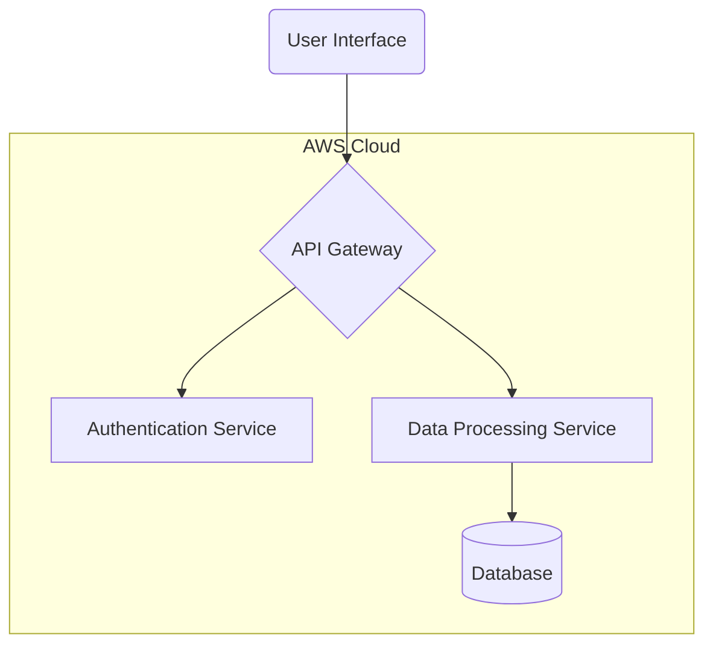

# System Block Diagram

A **System Block Diagram** is a high-level flowchart that provides a visual representation of a system. Its primary purpose is to illustrate the major components or functional blocks of the system and how they interact with each other.

Key characteristics of a system block diagram:

-   **High-Level View**: It abstracts away the details of the implementation, focusing on the functions of the components and their relationships. However, it should still provide enough detail to understand the system's architecture such as the tech stack chosen.
-   **Components**: Each block represents a major part of the system, such as a hardware module, a software service, or a user interface.
-   **Interconnections**: Lines or arrows connecting the blocks show the flow of data, signals, or control between them.

This diagram helps stakeholders, developers, and designers understand the system's structure and how its parts work together at a glance.


:::tip Diagrams as Code
For creating and maintaining diagrams within your Docusaurus site, consider using a "diagrams as code" tool like **Mermaid.js**. Docusaurus has built-in support for Mermaid, allowing you to generate diagrams directly from markdown-like text.

This approach makes it easy to version control your diagrams alongside your documentation and code.

Here is a simple example:

````md

````

For more examples see [Non UML Examples (Architectural Diagrams) in the project template](https://applebaumian.github.io/tu-cis-4398-docs-template/tutorial/tutorial-basics/mermaid#non-uml-examples-architectural-diagrams) 

:::
