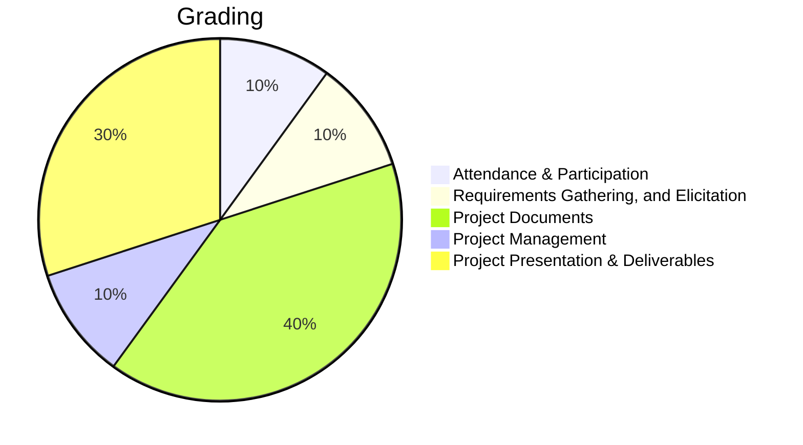

import Syllabus from '../components/Syllabus';
import Admonition from '@theme/Admonition';

import Figure from "../components/Figure";

import grading from "../../static/img/grading.png"
import feedback from "../../static/img/feedback-example.webp"
import jiraBoard from "../../static/img/jira-board-example.webp"
import Logo from "../../static/img/logo.svg"
import TOCInline from "@theme/TOCInline"

export const isOnlineClass = false;
export const isSummerClass = false;

 
 

    

        

            

## Table of Contents

            

        

        <left>
            <TOCInline toc={toc}/>
        </left>

    

---

# Course Syllabus

## Course Summary

Welcome to CIS 4398 Capstone Projects in Computer Science, your final course for the Computer Science Major! This course is designed to be the **culmination of your academic journey**, where you'll utilize all your previous coursework and outside experience **to build software as a team**. Our course motto, **"Don't Panic"**, is a reminder to embrace the unique challenges of this **purely project-driven and team-based environment**. It aims to prepare you for **real-world industry experiences** and provide a **tangible project to showcase on your resume**. You'll engage in an **agile software development environment** that's **user-focused, goal-driven, process-oriented, and emphasizes teamwork**. You will use industry-standard tools like **Jira software** for project management, planning, and estimating workload, **Docusaurus** for maintaining robust project documentation (a writing-intensive component making up 40% of your grade), and **GitHub** for managing code contributions, pull requests, and peer reviews, fostering heavy collaboration among team members.

This semester, you'll experience an **authentic capstone project** by integrating **real-world research problems** from the Temple University Human-Computer Interaction (HCI) Lab, moving beyond traditionally self-chosen projects. It's important to understand that the **goal of this course is not to conduct research or to learn research methods, but rather to focus on the software engineering aspects** of developing these systems. Your technical contribution and creativity will come from applying your **problem-solving skills and technical creativity to build these significant software systems**. To emulate industry experiences, **research leads from the HCI Lab will act as external stakeholders**, providing feedback and navigating requirements, much like clients in a professional setting. See [projects](#projects) section for information on project details, topics, and stakeholders. These projects are chosen to be "resume-worthy" and will give you **hands-on experience** in the software development lifecycle, preparing you for the industry. You are encouraged to be **flexible with programming languages and technologies** such as JavaScript, Python, React, Next.js, and Docker, choosing what best fits your project rather than sticking to familiar languages if they are not the optimal choice.

### What You Will Learn

- **Hands-On Experience**: Work in an environment that mirrors professional software development.
- **Project Development**: Navigate all stages of project design, from ideation to final deployment.
- **Real-World Applications**: Apply knowledge from previous courses to create functional and impactful projects.
- **Teamwork**: Collaborate effectively with peers to achieve shared goals.
- **Project Management**: Master Agile techniques, Jira, and GitHub for efficient project workflows.
- **Documentation Skills**: Learn to create comprehensive technical documents that reflect industry standards.
- **Literature Review**: Students will learn to conduct a literature search to support their design decisions and to cite sources appropriately.

Your project deliverables will involve writing-intensive components, iterating on feedback to produce high-quality work evaluated using rubrics.

:::danger
### Attendance Policy
**Attendance is mandatory for this course.** Each student is allowed a maximum of **3 absences** throughout the semester. Beyond this limit, your grade may be negatively affected. Attendance is crucial for success, as it ensures active participation in team projects and access to stakeholder feedback. Please make every effort to attend all classes and notify your instructor in advance if you must be absent.
:::

### How Your Work Will Be Evaluated

#### Group Performance

- Deliverables meeting requirements.
- Project complexity and innovation.
- Team collaboration and effective communication.

#### Personal Performance

- Initiative and proactive contributions.
- Quality of individual work and ideas.
- Positive and supportive team attitude.

Using GitHub and Jira metrics, your participation and progress will be assessed to ensure fairness and alignment with industry practices.

Your work will be graded based on:

- Quality and completeness of project deliverables.
- Collaboration and contribution to your team.
- Ability to meet deadlines and manage resources effectively.
- Documentation that demonstrates clear and professional communication.

<Figure src={grading} caption="Grading Criteria and Weight Distribution"/>

### Tools and Technologies

In this course, you will use tools like Jira for project management and GitHub for version control, ensuring you are prepared for industry practices.

<Figure src={jiraBoard} caption="Jira Software Scrum Board"/>

### Documentation and Writing Requirements

    <Figure caption={"Write > Submit > Feedback > Revise > Submit Again"}>
        
    </Figure>

As a writing-intensive course, your ability to document and communicate technical ideas is crucial. You'll use Docusaurus, a modern documentation tool, to organize and present your work. Feedback will be provided via Jira tickets to mirror professional feedback processes. You will:

- Submit initial drafts of your documentation.
- Receive detailed feedback to guide revisions.
- Resubmit improved versions for final grading.

#### Key Documentation Deliverables

1. **Project Proposal**: Define your project goals, user benefits, and requirements.
2. **Requirements Specification**: Detail your project's features and success criteria.
3. **Design Documents**: Create architecture and API documentation with diagrams.
4. **Test Procedures**: Document your testing strategies and outcomes.

[//]: # (
)

[//]: # (    <Figure src={feedback} caption={"Example of feedback given to students' Docusaurus web page."}/>)

[//]: # (
)

### Docusaurus for Project Documentation

    <a href={"https://docusaurus.io/"} target="_blank" rel="noopener noreferrer">
        <Logo style={{float:"left", marginRight:"50px"}}/>
    </a>

[Docusaurus](https://docusaurus.io/) is a lightweight, open-source website builder that transforms your project documentation into professional-grade websites. **The best part? You don't need to know React, JavaScript, CSS, or HTML** to create comprehensive documentation.

#### Why Docusaurus Instead of Microsoft Word?

Modern software projects require documentation that can:
- **Live alongside your code** in Git for seamless version control
- **Support collaborative editing** without file conflicts
- **Deploy automatically** to create searchable, accessible websites
- **Integrate with professional workflows** used by tech companies worldwide

#### Your Documentation Portfolio

    <Figure
        id="blastpad-example-syllabus"
        caption={
            <a href="https://capstone-projects-2024-spring.github.io/project-blastpad/">
                
Project BlastPad Spring 2024

            </a>
        }
        subcaption={
            
Example of a previous capstone project&#39;s   Docusaurus-powered documentation site

        }
    >
        
    </Figure>

Using basic Markdown syntax, you'll create and maintain the four core technical documents outlined above. These documents mirror industry standards and provide you with real-world experience in professional technical writing.

#### Professional Development Experience

Your Docusaurus site will be:
- **Automatically deployed** via GitHub Actions to GitHub Pages
- **Permanently accessible** at a stable URL you can share with employers
- **Version-controlled** with complete revision history
- **Professionally formatted** without wrestling with document formatting

The custom course template simplifies setup, and GitHub Actions automate deployment, giving you real-world experience with modern documentation tools used at companies like Meta, Microsoft, and Netflix.

### Tracking Revisions and Feedback

Your documentation will be tracked on GitHub, providing clear visibility into changes. A "Revisions" button on your Docusaurus site links to GitHub diffs, making it easy for you to review updates and for instructors to provide feedback.

Feedback will be submitted as Jira tickets, allowing you to engage with comments and integrate them into your workflow. This approach ensures transparency and mirrors industry practices.

### Week-by-Week Schedule

{isOnlineClass && (

    <Admonition type="warning" title="Summer Session">
Due to the condensed nature of the summer session, this course is going to be much more intense. <strong>Lectures will be pre-recorded and uploaded to Panopoto</strong> and available on Canvas. All synchronous class sessions will be considered working and meeting times for your teams. Please make sure to keep up with these lectures and be very active and present in the classroom with your teams. There's going to be very little wiggle room. Your success will be primarily measured in your participation in your project and team. <a href="#class-motto">Please refer to the course motto!</a>
</Admonition>

)}

<Syllabus courseid={13} daysOff={` 2025-09-01 2025-11-24 2025-11-25 2025-11-26 2025-11-27 2025-11-28 2025-11-29 2025-11-30 `} />

### Technology specifications

This course requires the use of Canvas, including access to materials and assignment submission.
On-campus computer labs have resumed normal operations and are available for student use.
Limited resources are available for students who do not have the technology they need for class. Students with educational technology needs, including no computer or camera or insufficient Wifi-access, should submit a Student Technology Assistance Application located in TUPortal and linked from the [Dean of Students Support and Resources webpage](https://deanofstudents.temple.edu/support-and-resources). The university will endeavor to meet needs, such as with a long-term loan of a laptop or Mifi device, a refurbished computer, or subsidized internet access. [Internet Essentials from Comcast](https://www.internetessentials.com/) provides the option to purchase a computer for $150 and high-speed Internet service for $9.95 a month, plus tax. The [Emergency Broadband Benefit (EBB)](https://www.fcc.gov/broadbandbenefit) is available to purchase Xfinity, Verizon, T-Mobile, and other internet services. Qualified households can receive a temporary monthly credit of up to $50/month toward their Internet service and leased Internet equipment until the program's funding runs out.

{isOnlineClass && (

<h4>Online Web Meeting Tool</h4>

Online lectures will be conducted via <strong>Zoom web conferencing</strong>.
Zoom is a web conferencing tool available to all students, faculty and staff. It is used in all lectures
and labs. You can use this tool to meet with your team members or peers.
To access Zoom, login to TUportal and select Zoom from the left navigation menu or go directly
to temple.zoom.us. ZOOM training is provided by CAT. Zoom allows to share screens, slides,
whiteboard, mobile devices and remote desktop controls.

<Admonition type="note">
Hardwired network connections are more consistent than Wi-Fi for Zoom sessions. If
your network speeds are below the suggested rates, please try to move your
computer closer to the Wi-Fi router or try to hardwire your connection.
</Admonition>

<Admonition type="important" title="Camera and Microphone Requirement for online class">

The expectation is that students participate both by video and audio in online classes. All students
are required to have a working camera and headset during class times.

<ul>
<li>Microphone</li>
<li>Suggested models</li>
<li><a href="https://www.amazon.com/dp/B001R76D42?ref=nb_sb_ss_w_as-reorder-t1_ypp_rep_k0_1_9&amp=&crid=20KF2NRV4ZUCT&amp=&sprefix=samson+go">Samson Go Microphone (<strong>I use this one its really good</strong>)</a></li>
<li><a href="https://www.staples.com/Logitech-H390-USB-Wired-PC-Headset-for-Internet-Calls-and-Music-981-000014/product_710265">Logitech H390 Computer Microphone, Over-the-Head (better if you want headphones for privacy)</a></li>
<li>Webcam</li>
<li>Suggested models</li>
<li><a href="https://www.staples.com/Logitech-C270-HD-720p-Computer-Webcam-with-Microphone-960-000694/product_354562">Logitech C270 HD Webcam</a></li>
<li>Recommended Internet Speed: 8mbps download & 5mbps upload (Test at <a href="https://speedtest.net">speedtest.net</a>)</li>
</ul>
</Admonition>

)}

    

## Relevant University Policies for this course
Temple University provides various support services for students, including academic assistance, counseling, and resources for those with disabilities. Students are expected to attend classes regularly, participate actively, and uphold academic integrity by avoiding plagiarism and other forms of dishonesty. The university emphasizes a respectful and inclusive learning environment, valuing diverse perspectives and fostering open dialogue.

    

### Students with Disabilities

:::note
Please bear in mind that COVID-19 may result in a need for new or additional accommodations.
:::

Any student who has a need for accommodations based on the impact of a documented disability or medical condition should contact Disability Resources and Services (DRS) located in the Howard Gittis Student Center South, 4th Floor at drs@temple.edu or 215-204-1280 to request accommodations and learn more about the resources available to you. If you have a DRS accommodation letter to share with me, or you would like to discuss your accommodations, please contact me as soon as practical. I will work with you and with DRS to coordinate reasonable accommodations for all students with documented disabilities. All discussions related to **your accommodations will be confidential**.

### Student Support Services

The following academic support services are available to students:

- [Student Success Center](https://studentsuccess.temple.edu/)
- [University Libraries](https://library.temple.edu/webpages/remote-learner-support)
- [Undergraduate Research Support](http://www.temple.edu/vpus/research/index.html)
- [Career Center](https://www.temple.edu/life-at-temple/students/careers-and-internships/career-center)
- [Tuttleman Counseling Services](https://counseling.temple.edu/access-services)
- [Disability Resources and Services](https://disabilityresources.temple.edu/)

If you are experiencing food insecurity or financial struggles, Temple provides resources and
support. Notably, the Temple University Cherry Pantry and the Temple University Emergency
Student Aid Program are in operation as well as a variety of resources from the Division of
Student Affairs.

### Attendance and Your Health

We continue to meet the changing circumstances of the COVID- 19 pandemic with flexibility and by working together as a community. To achieve course learning goals, students must attend and participate in classes, according to the course requirements. However, if you feel unwell or if you are under quarantine or in isolation because you have been exposed to the virus or tested positive for it, you should not come to campus or attend in-person classes or activities. It is the student’s responsibility to contact me to create a plan for participation and engagement in the course as soon as you are able to do so, and to make a plan to complete all assignments in a timely fashion when illness delays your completion.

### Grading Scale

| A Range   | B Range   | C Range   | D Range   | F Range |
|-----------|-----------|-----------|-----------|---------|
| A: 94-100 | B+: 87-89 | C+: 77-79 | D+: 67-69 | F: 0-59 |
| A-: 90-93 | B: 84-86  | C: 74-76  | D: 64-66  |         |
|           | B-: 80-83 | C-: 70-73 | D-: 60-63 |         |

### Expectations for Class Conduct
The best way to maintain a safe and focused learning environment is for everyone to get vaccinated. We all need to follow the university guidance on masking as well. For your general health and well-being, hand washing and monitoring your health is still highly recommended.
It is also important to foster a respectful and productive learning environment that includes all students in our diverse community of learners. Our differences, some of which are outlined in the University's nondiscrimination statement, will add richness to this learning experience. Therefore, all opinions and experiences, no matter how different or controversial they may be perceived, must be respected in the tolerant spirit of academic discourse.
Treat your classmates and instructor with respect in all communication, class activities, and meetings. You are encouraged to comment, question, or critique an idea but you are not to attack an individual. Please consider that sarcasm, humor and slang can be misconstrued in online interactions and generate unintended disruptions. Profanity should be avoided as should the use of all capital letters when composing responses in discussion threads, which can be construed as “shouting” online. Remember to be careful with your own and others’ privacy. In general, have your behavior mirror how you would like to be treated by others.

### Statement on recording and distribution of recordings of class sessions

Any recordings permitted in this class can only be used for the student’s personal
educational use. Students are not permitted to copy, publish, or redistribute audio or video
recordings of any portion of the class session to individuals who are not students in the
course or academic program without the express permission of the faculty member and
of any students who are recorded. Distribution without permission may be a violation of
educational privacy law, known as FERPA as well as certain copyright laws. Any
recordings made by the instructor or university of this course are the property of Temple
University.

### Academic Freedom

Freedom to teach and freedom to learn are inseparable facets of academic freedom. The
university has adopted a [Policy on Student and Faculty Academic Rights and Responsibilities (links to an external site.)](https://secretary.temple.edu/policies).
http://policies.temple.edu/PDF/99.pdf

### Academic Honesty

According to the University Student Code of Conduct, students must not commit, attempt to
commit, aid, encourage, facilitate, or solicit the commission of academic dishonesty and
impropriety including plagiarism, academic cheating, and selling lecture notes or other information
provided by an instructor without the instructor’s authorization. Violations may result in failing the assignment and/or failing the course, and/or other sanctions as enumerated in the [University Code of Conduct (Links to an external site.)](https://studentconduct.temple.edu/policies).

