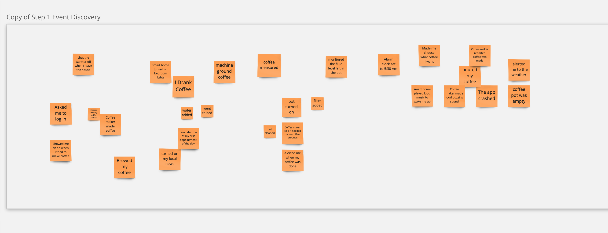
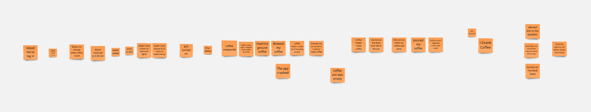

# Event Storming

Event storming is a workshop-based method to quickly find out what is happening in the domain of a software program (or entire business initiative). There are 5 steps to the process, but for this assignment we will only focus on the first 2. 

## 1. Discover Events

Events are things that happen in your application. They are written in the past tense. Let's say we're hypothetically designing a smart coffee maker. One event that would happen in the coffee brewing process is:  "_My coffee maker made a loud buzzing sound to let me the the coffee \`is ready\`_." or "_I drank the coffee made_". You will discover these events silently as a group for 10 minutes adding them to the top row of the Miro board as **orange sticky notes** (order does not matter in this step just write as many events as you can think of). 

## 2. Enforce Timeline

Take the events discovered in the previous step and start physically ordering them in the second row as a timeline. Discuss as a group if the events fit properly, if there are missing events add them. If an event doesn't make sense or is out of scope, add it to the bottom row known as the parking lot. After reading the time line multiple times, read the timeline backwards. Typically if you're missing an event in the timeline it's a lot more obvious when read backwards. 

Why? As we are still finalizing the Requirements Document, this exercise helps us gather requirements WITH the customer. 

We will be running this workshop in class using [Miro.](https://miro.com/welcome/azd0UzBtUmxhTW9SY2FMcDUwUGRBUnl4SWJTWWZsdzBSdW41UzdEdkFFS0FzTFFXcW1TMDVhM0hkZFo1eWN0cnwzMDc0NDU3MzY1MzIxMjgyMjQ4?share_link_id=317746713706) [Click here for the Event Storming Template!](https://miro.com/app/dashboard/?tpTemplate=o9J_lrmXT0E%3D&isCustom=true&share_link_id=388742645411) To turn in this assignment please **submit a link** to your Miro board. For this class we will focus mainly on discovering the _Events_ that happen in your project, and ordering them into a cohesive timeline.

**YOU SHOULD HAVE MORE EVENTS THAN THE ABOVE EXAMPLE.**

[Capstone Event Storming .pdf](https://templeu.instructure.com/courses/124586/files/22142098?wrap=1 "Capstone Event Storming  .pdf")