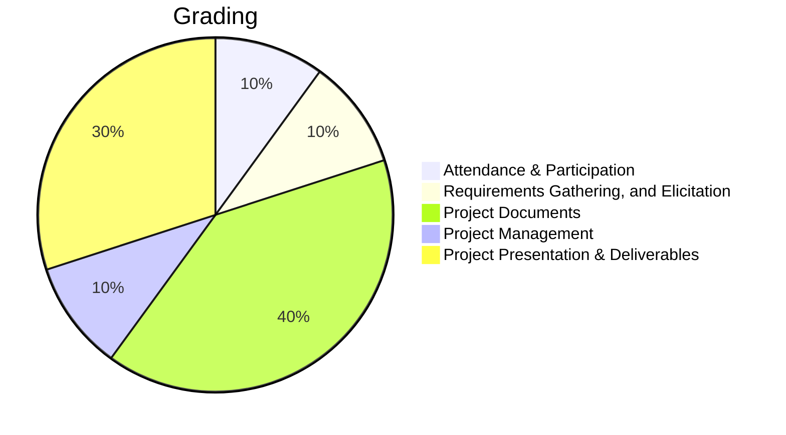

import Figure from "../src/components/Figure";
import grading from "../static/img/grading.png"

# Grading & Evaluation

## How Your Work Will Be Evaluated

### Group Performance

- Deliverables meeting requirements.
- Project complexity and innovation.
- Team collaboration and effective communication.

### Personal Performance

- Initiative and proactive contributions.
- Quality of individual work and ideas.
- Positive and supportive team attitude.

Using GitHub and Jira metrics, your participation and progress will be assessed to ensure fairness and alignment with industry practices.

Your work will be graded based on:

- Quality and completeness of project deliverables.
- Collaboration and contribution to your team.
- Ability to meet deadlines and manage resources effectively.
- Documentation that demonstrates clear and professional communication.

<Figure src={grading} caption="Grading Criteria and Weight Distribution"/>

:::danger
## Attendance Policy
**Attendance is mandatory for this course.** Each student is allowed a maximum of **3 absences** throughout the semester. Beyond this limit, your grade may be negatively affected. Attendance is crucial for success, as it ensures active participation in team projects and access to stakeholder feedback. Please make every effort to attend all classes and notify your instructor in advance if you must be absent.
:::

## Grading Scale

| A Range   | B Range   | C Range   | D Range   | F Range |
|-----------|-----------|-----------|-----------|---------|
| A: 94-100 | B+: 87-89 | C+: 77-79 | D+: 67-69 | F: 0-59 |
| A-: 90-93 | B: 84-86  | C: 74-76  | D: 64-66  |         |
|           | B-: 80-83 | C-: 70-73 | D-: 60-63 |         |
