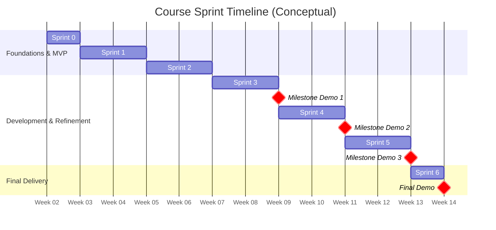

import { LocalizationProvider } from '@mui/x-date-pickers';
import { AdapterDayjs } from '@mui/x-date-pickers/AdapterDayjs'
import Syllabus from '../src/components/Syllabus';
import Admonition from '@theme/Admonition';

# Course Schedule (Overview)

## How the Semester Is Structured

This course follows an Agile, sprint-based structure modeled after real-world software teams.
While specific lecture topics may shift based on project needs, sprint goals and milestone expectations remain consistent throughout the semester.

- The semester is divided into **six sprints**
- Early sprints (0-2) emphasize **problem understanding and documentation**
- Later sprints (3-6) emphasize **development, iteration, and delivery**
- Stakeholder feedback is incorporated throughout the process

For more details on sprint activities, see the [Sprints & Milestones](./sprints) section of the syllabus.

:::warning Disclaimer
This is a 17 week course including breaks. The timeline above is conceptual and the week axis may not correspond to this because of Holidays and Breaks.
:::

## Weekly Rhythm

This course follows a consistent weekly structure designed to balance instruction, collaboration, and project work:
- **Mondays:** Team Meetings / Stakeholder Meetings / Project Work
- **Wednesdays:** Lectures / Workshops
- **Fridays:** Team Meetings / Project Work

On the next page, you can find a detailed breakdown of the sprint timeline and key milestones.
